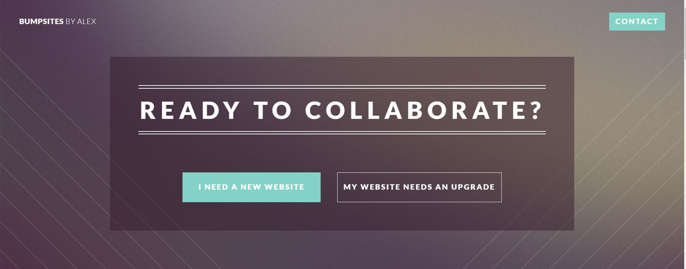

# Bumpsites

Main hub for my portfolio website

## Summary

This is where I take client requests and display recent fullstack web applications. It is also a hub for my contact information
and social media pages. 

## Authors

Alex Fulop
[Bumpsites](bumpsites.netlify.app)

## Version History

* 0.1
    * Initial Release

## License

This project is licensed under the Alex Fulop License - see the LICENSE.md file for details

## Acknowledgments

Inspiration, code snippets, etc.
* [awesome-readme](https://github.com/matiassingers/awesome-readme)
* [PurpleBooth](https://gist.github.com/PurpleBooth/109311bb0361f32d87a2)
* [dbader](https://github.com/dbader/readme-template)
* [zenorocha](https://gist.github.com/zenorocha/4526327)
* [fvcproductions](https://gist.github.com/fvcproductions/1bfc2d4aecb01a834b46)